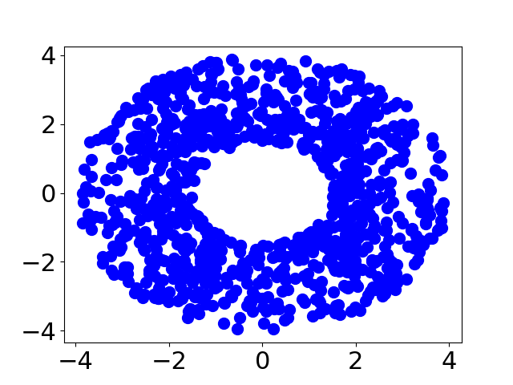
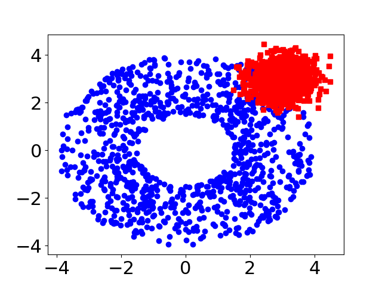
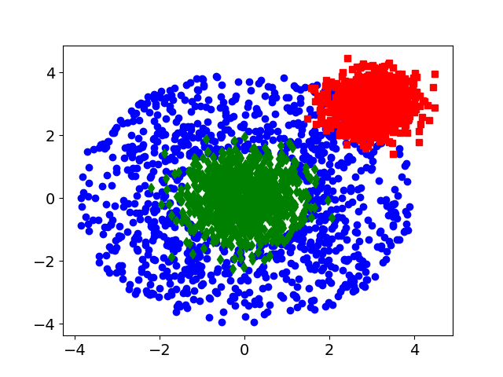
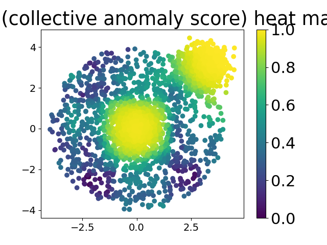
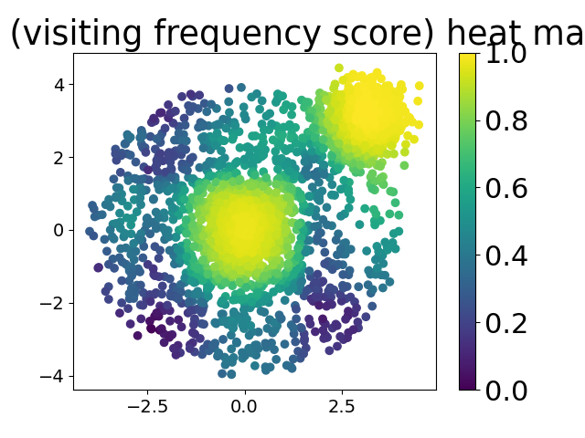
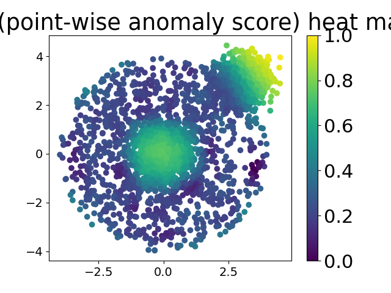
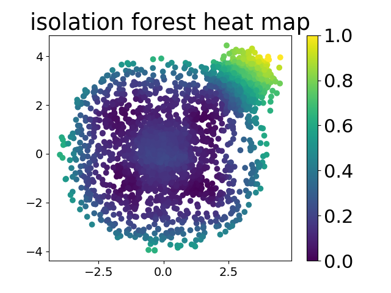

# Test Results

## Generated Images

## CSV Results

| Method | AUC |
| --- | --- |
| Isolation Forest | 0.721928 |
| diff_rf (point-wise anomaly score) | 0.9534605000000002 |
| diff_rf (frequency of visit scoring only) | 0.9832939999999998 |
| diff_rf (collective anomaly score) | 0.9846910000000001 |

